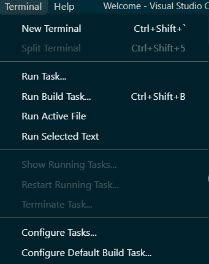
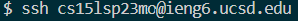
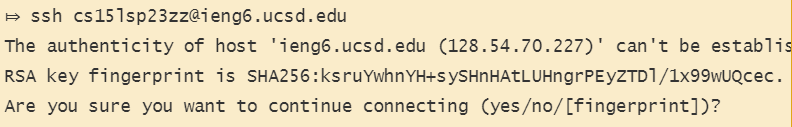
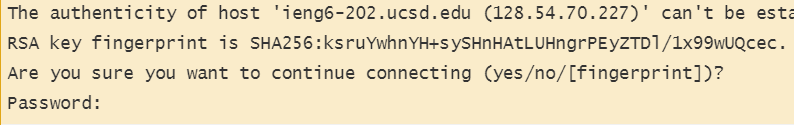
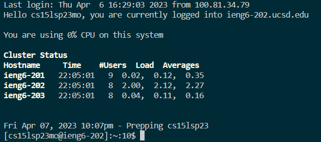
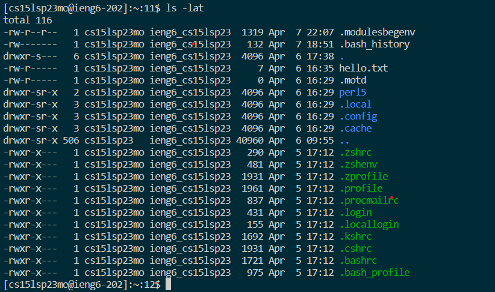
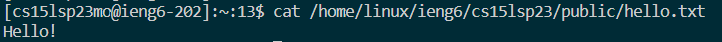

Part 1: CSE15L Account
======================
Use this [link](https://sdacs.ucsd.edu/~icc/index.php) to access your specific CSE15L account:  
 * Use your UCSD username (e.g. xxx000) and PID (e.g. A12345678) to login  
 * Your CSE15L account username should start with "cs15l..."
  
For help on resetting your password, use this [tutorial](https://drive.google.com/file/d/17IDZn8Qq7Q0RkYMxdiIR0o6HJ3B5YqSW/view?usp=share_link)  
  
Part 2: Visual Studio Code
==========================
Visual Studio Code is the coding platform we will be using.  
*(Skip this step if VScode is already downloaded on your computer or if you're using the lab's computer)*  
Go to [Visual Studio Code](https://code.visualstudio.com/) and follow the instructions to download it onto your computer.  
When finished installing, you should open up a window that is similar to this:  

Part 3: Remotely Connecting
===========================
To get started:
---------------
* For Windows: install [Git for Windows](https://gitforwindows.org/) for the useful tools we need.  
* Once finished installing **git** , use this [tutorial](https://stackoverflow.com/a/50527994) to set up your newly installed git bash default terminal in VScode.  

To use **ssh**:
---------------
* Open a terminal in VScode  

* Type in: ssh (CSE15L username)@ieng6@ucsd.edu  

* If it's your first time connecting, a message like this should appear:
  
* Type **yes** and press enter, which will then ask you for password. Type in the password that you've created for your CSE15L account. *(Note: typing the password onto the terminal will be invisible because of security reasons)*  

* Once you've logged in, a message like this should appear:
  
Now your terminal is remotely connected. Commands run by you will run onto a connected computer elsewhere.

Part 4: Running Commands
========================
There are many commands you can run on both your computer and the remote computer:
* **cd**
* **ls**
* **pwd**
* **mkdir**
* **cp**  

For example: you can run the command **ls** to view the listed files and folders of the directory like this:
  
Also, you can use more commands like **cat** in your terminal.  
**cat** allows you to view the content of a file
  

Part 5: How to log out
======================
After completing your work on VScode, it is important to log out of the remote server in your terminal.  
To log out, you can use either:
* Ctrl-D
* Run the command **exit** on your terminal
