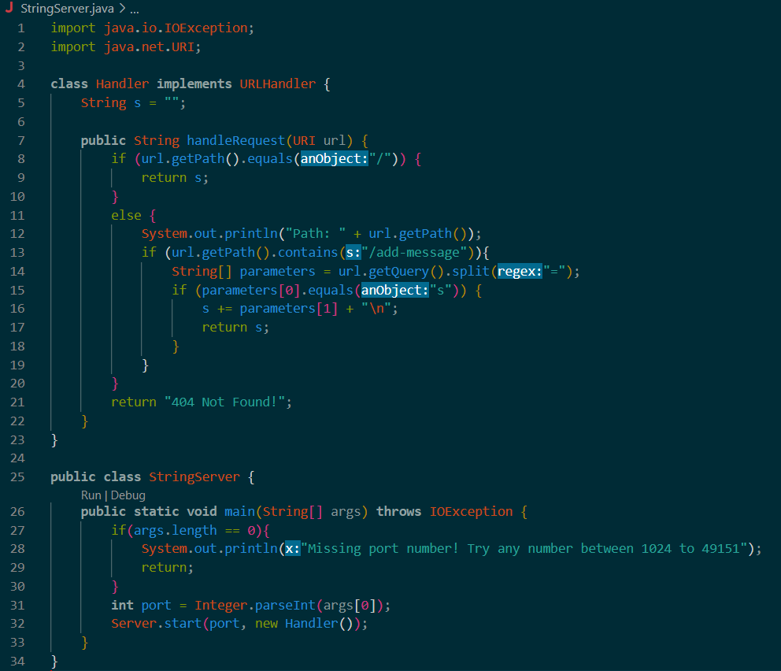
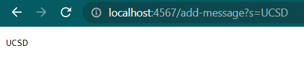
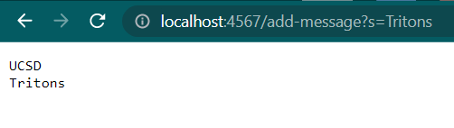
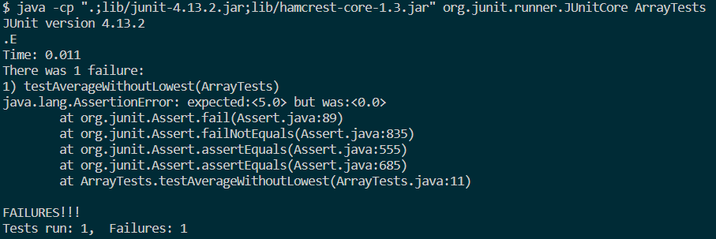
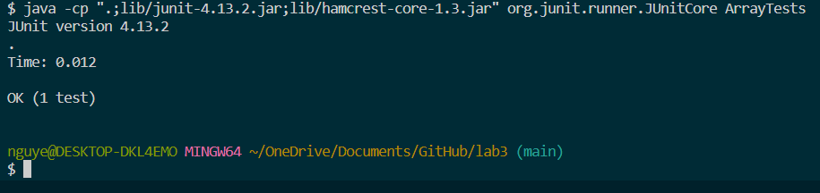

# Lab Report 2 - Servers and Bugs
## Part 1:
**StringServer.java** code:  
  
  
  
### Using */add-message*: 
Screenshot #1:  
  
* In my code, the StringServer class' main method and Handler class' handleRequest method were called
* First, by writing "java StringServer 4567" in the terminal, it starts a server with port 4567 and calls upon the Handler class.
  In the Handler class, there is an empty string variable "s" that will be printed on the website. Then the handleRequest method uses URI
  import to get the URL of the server that was started
* On the website, by adding "/add-message?s=Tritons" at the end of the URL, the code checks if the new URL matches the correct format for it to
  concatenate. After checking, it correctly matched so it adds the string "Tritons" and "\n" to variable "s" thus changing the variable "s" and getting printed 
  onto the page
   
     
Screenshot #2:  

* The method handleRequest in the Handler class was called
* Currently the variable "s" is "UCSD + \n" and the handleRequest method's parameter is "http://localhost:4567/add-message?s=Tritons".
* Because the URL got changed and requested to add-message, my code checked for the correct formatting and then concatenated "Tritons" to the variable "s"
  which would then be printed onto the page
  
## Part 2:  
#### Bugs in averageWithoutLowest  
**failure-inducing input:**  
```
public void testAverageWithoutLowest(){  
double[] input1 = {5.0, 5.0, 5.0};  
double result = ArrayExamples.averageWithoutLowest(input1);  
assertEquals(5.0, result, 0.0);  
}  
```
  
**non-failure-inducing input:**  
```
public void testAverageWithoutLowest(){  
  double[] input1 = {6.0, 10.0, 3.0};  
  double result = ArrayExamples.averageWithoutLowest(input1);  
  assertEquals(8.0, result, 0.0);  
}  
```
  
**failure-inducing input symptom:**  
  
  
**non-failure-inducing input symptom:**  
  

**code before change:**
```
static double averageWithoutLowest(double[] arr) {  
    if(arr.length < 2) { return 0.0; }  
    double lowest = arr[0];  
    for(double num: arr) {  
      if(num < lowest) { lowest = num; }  
    }  
    double sum = 0;  
    for(double num: arr) {  
      if(num != lowest) { sum += num; }  
    }  
    return sum / (arr.length - 1);  
}  
```
    
**code after change:**  
```
static double averageWithoutLowest(double[] arr) {
    if(arr.length < 2) { return 0.0; }
    double lowest = arr[0];
    for(double num: arr) {
      if(num < lowest) { lowest = num; }
    }
    double sum = 0;
    for(double num: arr) {
      sum += num;
    }
    return (sum - lowest) / (arr.length - 1);
  }
```
**why the fix addresses the issue:**  
The issue beforehand was that if all the elements in arr were the same, nothing would get added to **sum** since the lowest is all of them. This code fixes it by first
identifying what the lowest is and storing it in the variable **lowest**. Then it adds all the elements in arr together in the variable **sum**. Then to take out the lowest, 
**sum** just minus the variable **lowest** and then divide by the total length of arr - 1 to count for removing the lowest element. This allows **sum** to just remove one of the lowest
element even if there are many elements with the same lowest value.
   
## Part 3:  
During week 2 lab, I learned that running a server while using the same port as someonelse would result in an exception. If muiltiple people tried to start a server with
the port 4000 for example, only one person can create it while the others would get an exception message. I learned that to fix this issue, you simply just have to change
the port number to something unique that someone else wouldn't have. Also, I learned that to run someone else's server, I need to have their ieng6 machine as well as their
port.
