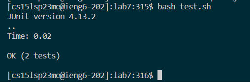

# Lab Report 4
## Step 4: Log into ieng6
First open up a new window in VS Code. Then open up a new terminal with the keys ```<Ctrl+Shift+`>```  
and type ```ssh cs15lsp23__@ieng6.ucsd.edu``` to log into your ieng6 account.
  

## Step 5: Clone your fork of the repository from your Github account
To clone the repository from Github, first open up a web browser and go to the GitHub website.  
Next log into your GitHub account and find the forked repository. Click on the forked repository  
and find a tab that says ```<> Code```. Once you click it, you would find a tab that says ```SSH```.
Click on  
```SSH``` and copy the SSH URL in the box by highlighting it and using ```<Ctrl-C>``` which is a hotkey for copying.  
  
  
  
Now switch over to VS Code and in your terminal type ```git clone``` and then use ```<Ctrl-V>``` which is a hotkey for pasting   
to paste over the SSH URL from GitHub.
  

## Step 6: Run the tests, demonstrating that they fail
First, we have to go into the forked repository we cloned by typing in the terminal ```cd lab7```  
Next, we have to run the tests by typing in the terminal ```bash test.sh```  
By doing that, we will see that our tests has failed, indicating that the code has a bug.  
  

## Step 7: Edit the code file to fix the failing test
To edit the code file, we first type in the terminal ```vim ListExamples.java``` and screen like this should pop up:
  

  
Now to fix the bug, we type ```/1<Space><Enter><Shift-n>r2``` and then we save and quit by typing ```:wq<Enter>```  
The ```/``` is a command in vim to seach for certain keywords so when we follow it up with ```1<Space>```, we are looking  
for every words in the file that has a 1 followed by a space. Next we press ```<Enter>``` to confirm the search and stop it.  
Then by pressing ```<Shift-n>```, this looks for our keyword from bottom up and then then we press ```r``` followed by  
```2``` to replace the character under our cursor with 2. Lastly, the ```:wq<Enter>``` saves and quit the vim.  
Overall, we should see a change in the code like this where index1 became index2:  
  

## Step 8: Run the tests, demonstrating that they now succeed
Now to see if the code was changed correctly, we test it again by pressing ```<up><up><Enter>``` since we already used  
```bash test.sh``` earlier so it should be stored in 2 up in our terminal history. And as a result, we should get a screen like this:  
  

## Step 9: Commit and push the resulting change to your Github account
Firstly, we need to add the changes we made by typing in the terminal ```git add ListExamples.java```  
(```git add``` is used to add changes in Git since changes are not automatically included in the next commit)  
Next, we need to commit this by typing in the terminal ```git commit -m "Updated"```  
(```git commit -m``` is used to create a new commit in Git with a commit message, in this case the message is "Updated")  
  

  
Lastly, we need to push this into our GitHub by typing in the terminal ```git push```  
(```git push``` is used to upload the local commits in our Git repository to a remote repository like GitHub)  
  

