# Lab Report 5: 
## Part 1 – Debugging Scenario  
### EdStem post:
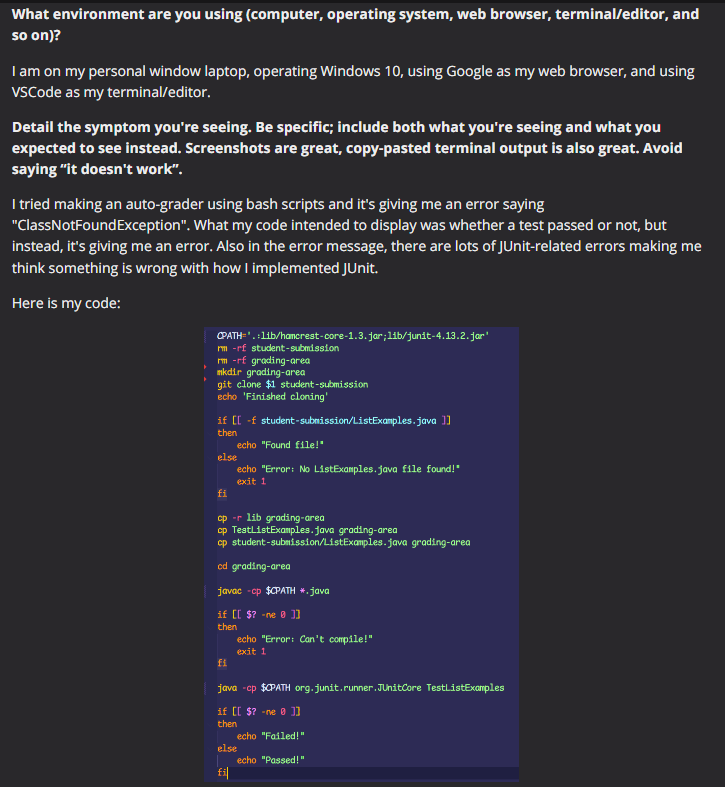
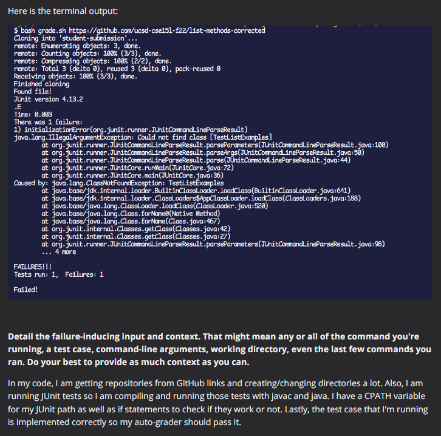
### A response from a TA:
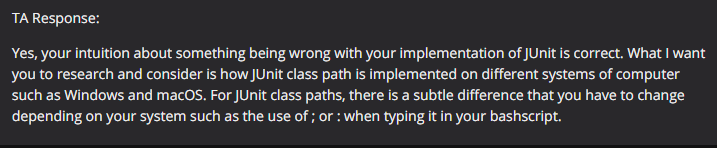
### Result from feedback:
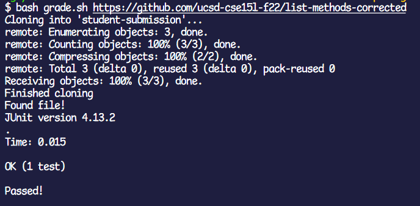  
The bug encountered was a result of me using a Windows system computer while trying to use a classpath seperator for macOS/Linux.  
For Windows computer, the ";" is used as the classpath seperator while the ":" is used as a path seperator for macOS/Linux.  
In my code, I assigned the variable CPATH with the use of ":" instead of ";" thus causing the compilation of my code to fail since it's on  
the wrong platform.
### Information needed about the setup:
* The file & directory structure needed:
  * 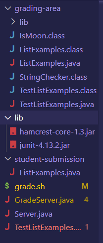
* The contents of each file before fixing the bug
  * **grading-area**: this is a directory of where all the files needed to auto-grade goes when testing a submission.
  * **lib**: this is where the JUnit jar files are stored at.
  * **student-submission**: this is where the code of the student submission is stored at.
  * **grade.sh**: this is the code for the bash script of the auto-grader
    * 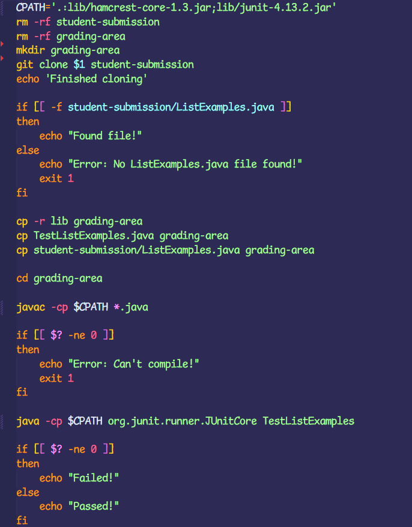
  * **GradeServer.java**: this contains the code for uploading the results of the auto-grader onto a webpage.
    * 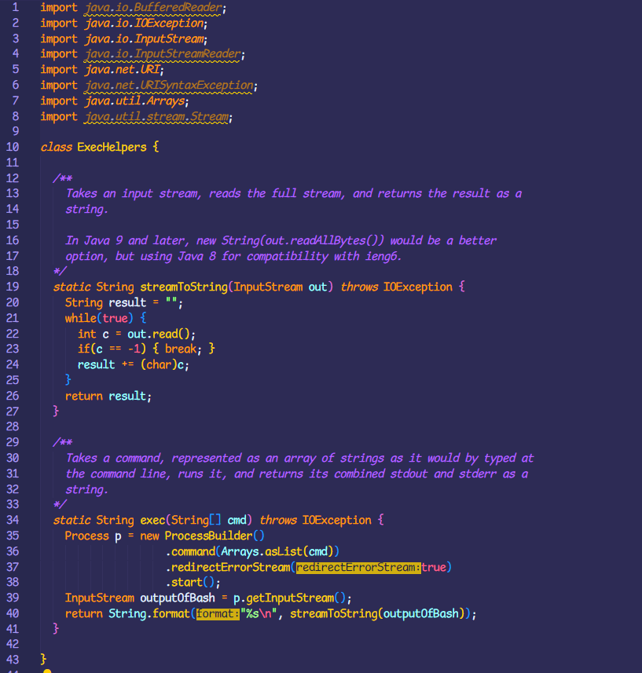
    * 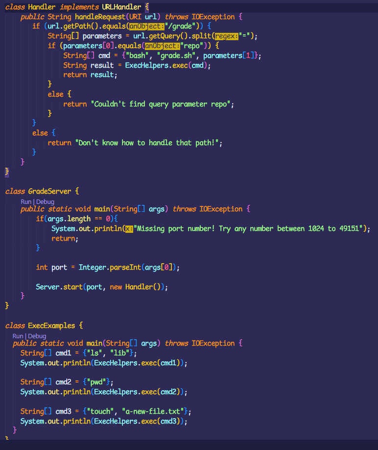
  * **Server.java**: this contains the code for creating a server/webpage.
    * 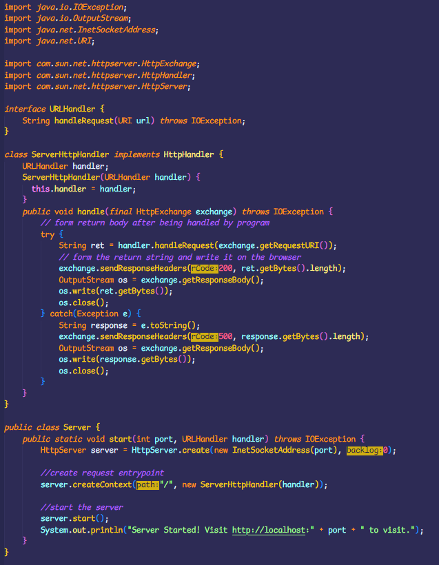
  * **TestListExamples.java**: this contains the test used to check whether a code implements correctly or not.
    * 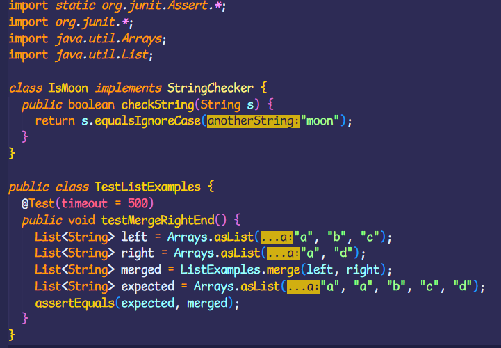
* The full command line (or lines) you ran to trigger the bug
  * The bug was triggered by lines that have $CPATH since CPATH had the wrong classpath seperator
  * 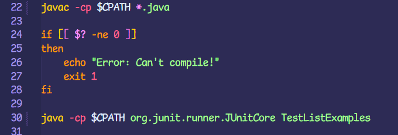
* A description of what to edit to fix the bug
  * In the file **grade.sh** edit the CPATH variable so that it replaces ":" with ";"
  * The overall change should look like this: '.;lib/hamcrest-core-1.3.jar;lib/junit-4.13.2.jar'
## Part 2 – Reflection
In past couple of weeks of going to lecuture and lab, there were two major experiences that has been very interesting to me.  
The first one was the use of bash scripts to create auto-graders, in which you can write comamnds in the script to change different  
directories and run JUnit tests. I imagine that there could be countless cool functionality that I could make using a script. The  
second thing that caught my attention was the introduction of VIM. I find it awesome that you could edit a file without having to open  
it up in a VSCode window. So whenever you need to fix a simple mistake, VIM can help you access the file quickly and make a quick edit. Overall, I think CSE15L is a very interesting class in learning different tools to assist you in coding.
